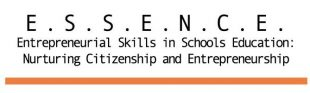
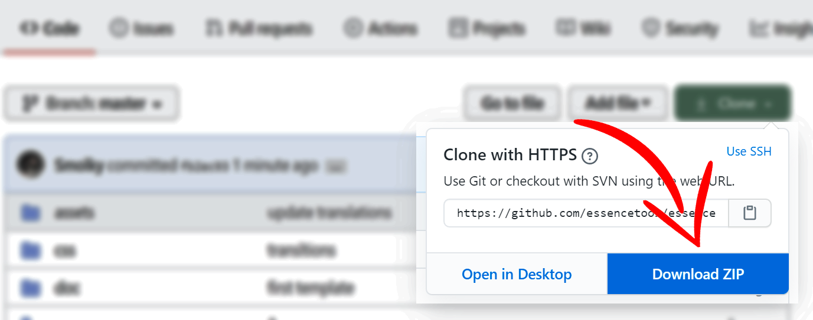

<!-- PROJECT LOGO -->
<br />
<p align="center">
  <a href="https://www.um.es/essenceeu/tool/Herramienta-ESSENCE.html">
    
  </a>

  <h3 align="center">E.S.S.E.N.C.E. tool</h3>

  <p align="center">
    ESSENCE – entrepreneurial skills in schools education: nurturing citizenship and entrepreneurship
    <br />
    <br />
    <a href="https://pln.inf.um.es/essence">Use the tool</a>
    ·
    <a href="https://github.com/essencetool/essence/issues">Report Bug</a>
    ·
    <a href="https://github.com/essencetool/essence/issues">Request Feature</a>
  </p>
</p>


<p align="center">
  
</p>


# Essence
Essence is a open-source project to help educators for acquiring/evaluating the entrepreneurial competences. Learn more about the project at [the web of the European Project](https://essenceproject.eu/project-objectives/)

Essence Tool is build upon web technologies and it is only need to use a browser to use it. The web-browser requires the IndexedDB API (see [compatibility](https://caniuse.com/#feat=indexeddb)).

As all the data you manage in the app is stored in your browser, you are free to use the tool from the following URL: https://pln.inf.um.es/essence


## Humans.txt
This tool has been developed by the University of Murcia [UMU](https://www.um.es/).

- Project coordinator: Linda Castañeda <lindacq@um.es>
- Programmer: José Antonio García-Díaz <joseantonio.garcia8@um.es>


## Getting Started
However, there are a few cases in which you should download the tool in your computer. 

* If you want to create your own rubrics or self-assessments
* If you want to embed this tool inside another education platform such as [Sakai](https://www.sakailms.org/)
* If your needs require to modify the source files of the project
* If you need to create a custom translation of the app


All you need to do is to download the project (as is described in the following figure), unzip it to a local folder, and then open the file "index.html" in your favorite browser.



### build
In addition, it is possible to use [Nativier](https://github.com/jiahaog/nativefier/blob/master/docs/api.md#platform) to build a desktop version of the platform. Here are some examples. 

```
nativefier --name "Essence App" "https://essencetool.github.io/essence/"
nativefier --name "Essence App" "https://essencetool.github.io/essence/" --platform windows
```

Pre-build versions can be fount at
```
https://pln.inf.um.es/essence/dist/essence-win.zip
https://pln.inf.um.es/essence/dist/essence-linux.zip
```

## Contributing
Pull requests are welcome. For major changes, please open an issue first to discuss what you would like to change.

Please make sure to update tests as appropriate.

## License
This project is licensed under the MIT License

## Acknowledgments
This project is funded by the European Union by the [Erasmus+ program](https://ec.europa.eu/programmes/erasmus-plus/node_en)


<p align="center">
  
</p>
